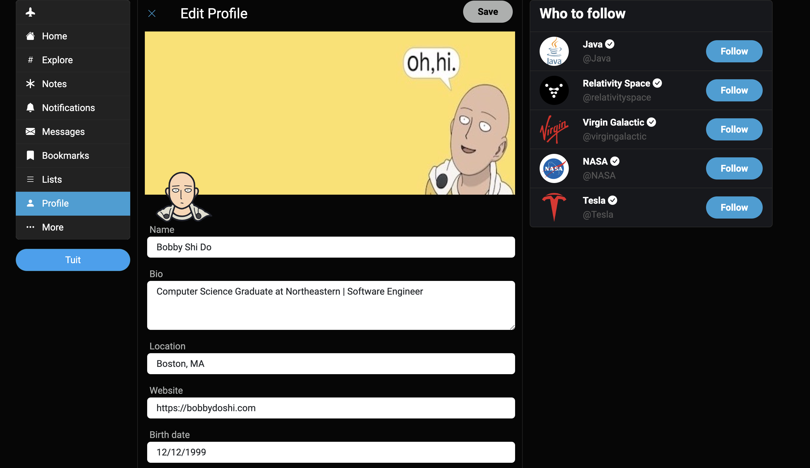
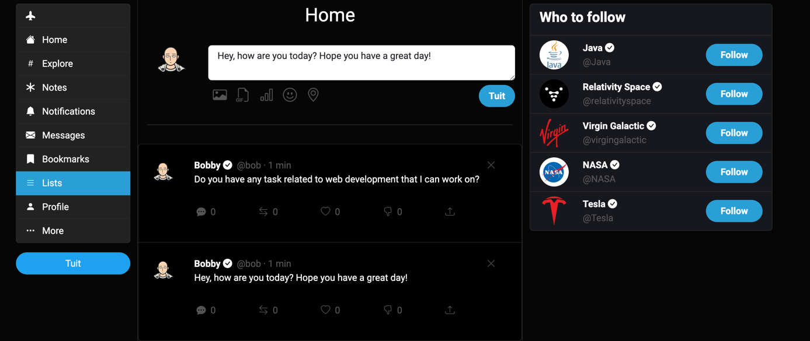
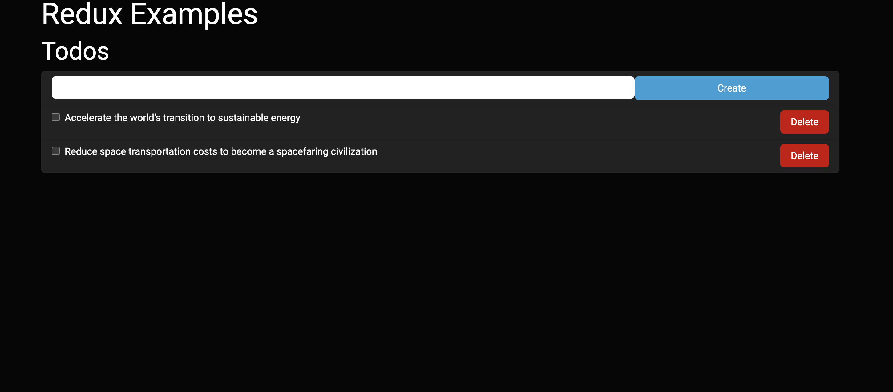

# Tuiter - Social Media Platform Sandbox

Tuiter is a custom social media platform designed to emulate the core features of Twitter. This project was created as a learning tool for React, Redux, and related technologies. Users can engage with the platform by creating posts, reacting to them, and managing their own notes.

## Features

- **Tuiter**: Users can post messages, like and dislike posts, and delete their own posts.
- **Explore**: Discover and follow trending topics.
- **Profile Management**: Create and edit user profiles, with personalized bios, locations, and website links.
- **Notes**: A notes section where users can jot down and manage personal notes, using Redux for state management.
- **Interaction**: Engage with posts through reactions like hearts and dislikes, demonstrating real-time interaction within the platform.

## Screenshots

### Profile Page


### Tuit Page


### Note Page


## Technologies Used

- React.js
- Redux Toolkit
- React Router
- Axios for API requests
- Node.js and Express.js for the backend API - [Tuiter Sandbox Server](https://github.com/BobErgot/Tuiter-Sandbox-Server)

## Getting Started

Follow these instructions to get a copy of the project up and running on your local machine for development and testing purposes.

### Prerequisites
- npm
    ```sh
      npm install npm@latest -g
    ```
### Installation

1. **Clone the repository:**
   ```sh
   git clone https://github.com/BobErgot/Tuiter-Sandbox
   ```
   
2. **Navigate to the project directory:**
   ```sh
   cd Tuiter-Sandbox
   ```

3. **Install the necessary packages:**
   ```sh
   npm install
   ```

4. **Set up the environment variables in a .env file in the root directory:**
   ```sh
   REACT_APP_API_BASE='http://localhost:4000/api'
   ```

### Running the Application
Run the following command to start the application:
   ```sh
   npm start
   ```
This will launch the app in development mode. Open http://localhost:3000 to view it in the browser.

## Code Structure

- `tuiter-service.js`: Manages API requests for posting and interacting with tuits.
- `tuits-thunks.js`: Contains thunk middleware for asynchronous Redux actions.
- `App.js`: Sets up routing and navigation using React Router.
- `profile/`: Includes components and reducer for user profile management.
- `notes/`: Features components and Redux setup for managing personal notes.
- `tuit-item.js`: Renders individual tuit posts with functionality to delete.
- `tuit-stats.js`: Provides UI for tuit interactions like likes and dislikes.
- `tuits-list.js`: Displays a list of tuits with real-time updates.
- `tuits-reducer.js`: Manages the state of tuits, including adding and removing reactions.

## License
Distributed under the MIT License. See the LICENSE file for more details.